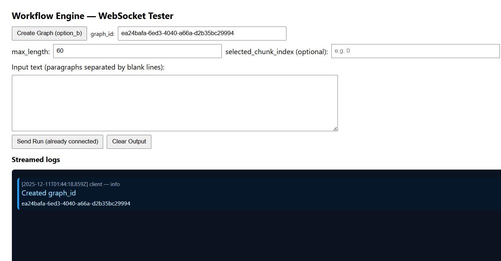
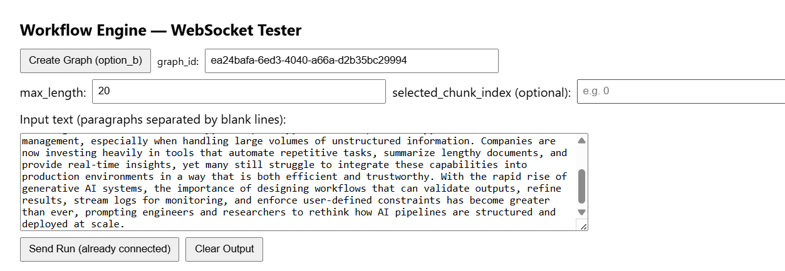
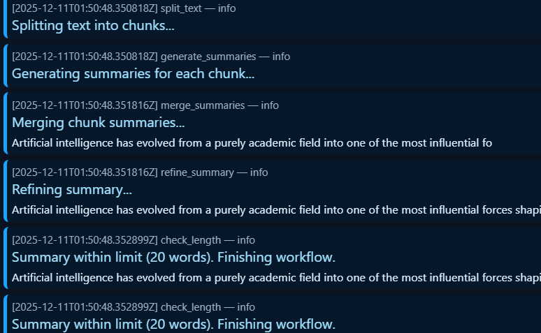
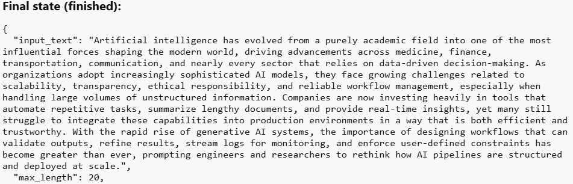
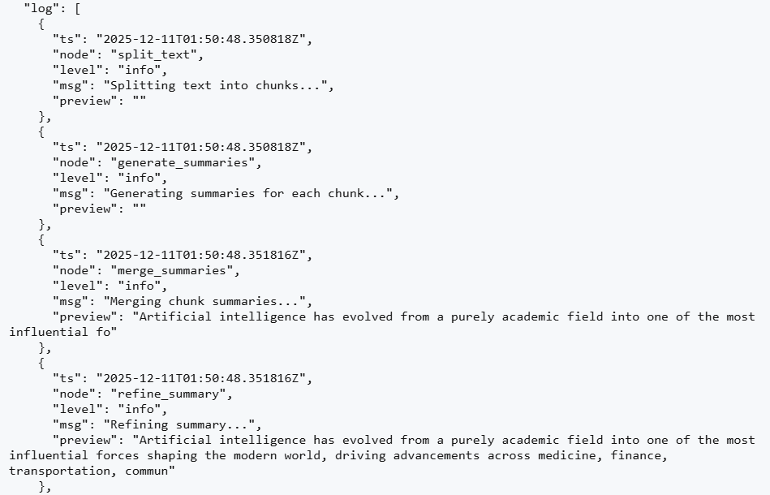

# Summarization-Engine
A modular FastAPI‑based workflow engine that performs multi‑step text summarization with real‑time WebSocket log streaming and a simple HTML testing UI.

**Overview:**

This project implements a node‑based workflow engine designed to summarize long text inputs through multiple processing steps:

1. Text chunking
2. Per‑chunk summarization
3. Summary merging
4. Refinement
5. Length enforcement
6. WebSocket streaming for real‑time logs
	
It also includes a lightweight HTML WebSocket tester UI to observe logs and workflow results.

**Project Structure:**

	Summarization-Engine/
	│
	├── app/
	│   ├── main.py          # FastAPI app & routes
	│   ├── engine.py        # Workflow engine core
	│   ├── workflows.py     # All workflow nodes
	│   ├── models.py        # Pydantic schemas
	│   └── __init__.py
	│
	├── test_ws.html         # WebSocket Tester UI
	├── requirements.txt     # Python dependencies
	├── .gitignore
	├── README.md
	└── (venv ignored)
**Installation:**

1. Clone the repository:
   
		git clone https://github.com/poshak2706/Summarization-Engine.git
		cd Summarization-Engine
2. Create & activate a virtual environment:
	
		python -m venv .venv
		source .venv/bin/activate     # Mac/Linux
		.venv\Scripts\activate        # Windows
3. Install dependencies:
   
		pip install -r requirements.txt

**Running the Backend:**

1. Start the FastAPI server:

		uvicorn app.main:app --reload
	
2. The API will run at:

		http://127.0.0.1:8000

3. After starting the FastAPI server, open:

		test_ws.html

	Or host it locally:

		python -m http.server 8001
4. Open:

		http://127.0.0.1:8001/test_ws.html

**API Endpoints:**

POST /graph/run: Runs the workflow via normal HTTP.

GET /graph/state/{run_id}: Fetches final or intermediate workflow state.

WebSocket: ws://127.0.0.1:8000/ws/run: Streams live workflow logs and final result.

**Future Enhancements:**

1. LLM-based summarization 
2. Multi-language support
3. Better chunking strategy
4. Frontend UI enhancements

**OUTPUT SCREENSHOTS:**

_UI with Graph ID:_

_Sample Input:_

_Sample State Logs:_

_Sample Final State:_

_Final State Logs:_

